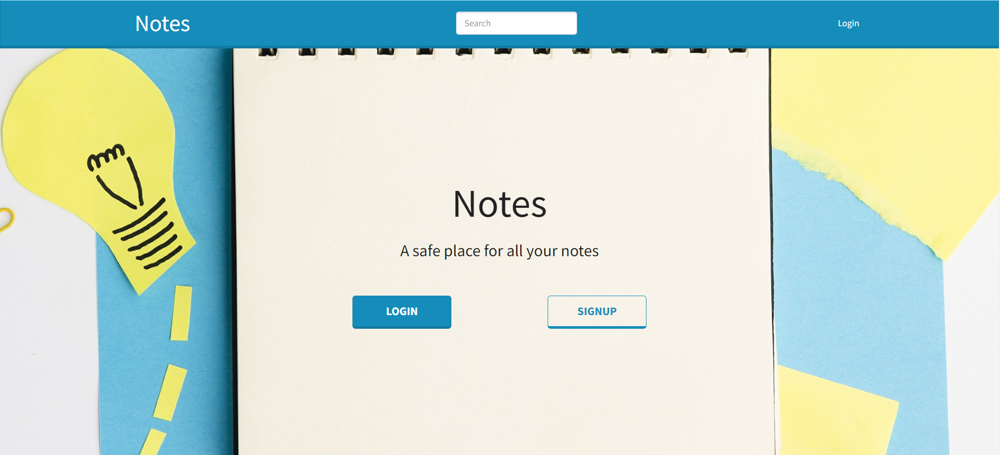

# Notes_App

A Safe Place For All Your Important Notes

## Technologies Used

- ReactJS (Frontend)
- NodeJS (Backend)
- Express (API)
- Redux (State Management)
- MongoDB (Database)

## Features

- Save, delete, and edit notes
- User profile with name, email, and picture
- Authentication: Login and Logout

## Screen Shot 



## Installation

```bash
git clone https://github.com/your-username/your-repo.git
cd your-repo
npm install


