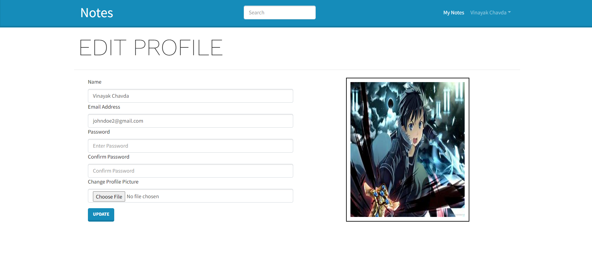

# Notes_App

A Safe Place For All Your Important Notes

## Technologies Used

- ReactJS (Frontend)
- NodeJS (Backend)
- Express (API)
- Redux (State Management)
- MongoDB (Database)

## Features

- Save, delete, and edit notes
- User profile with name, email, and picture
- Authentication: Login and Logout

## Screen Shot 

- Landing Page
  


- Register Page
  


- Notes Page
  


- Create Note
  


- Profile
    


## Installation

```bash
git clone https://github.com/vinayak501/Notes_App.git
cd Notes_App
npm install


